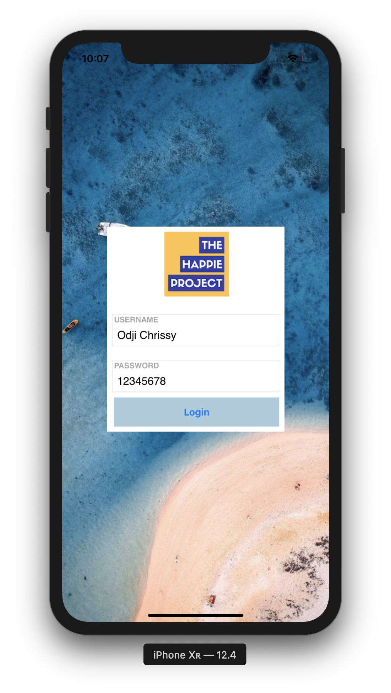

<center>
    <h1> <B>Login Screen </h1>
</center>

### About🖊
Designing a simple login screen on swift

<p align="center">
    
</p>

### Run🖊
To run this project, simply open:
```
14_LoginScreen.xcodeproj
```

### Requirement🖊
To run, you will need:
* Swift 10

---
Odji Chrissy 📩[satyananda.chrissy@gmail.com](mailto:satyananda.chrissy@gmail.com)

[Linkedin](https://linkedin.com/in/chrissysatyananda) | [Github](https://github.com/odjichrissy)
